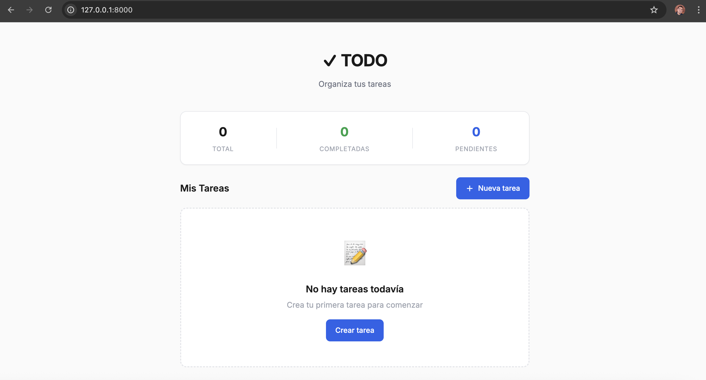
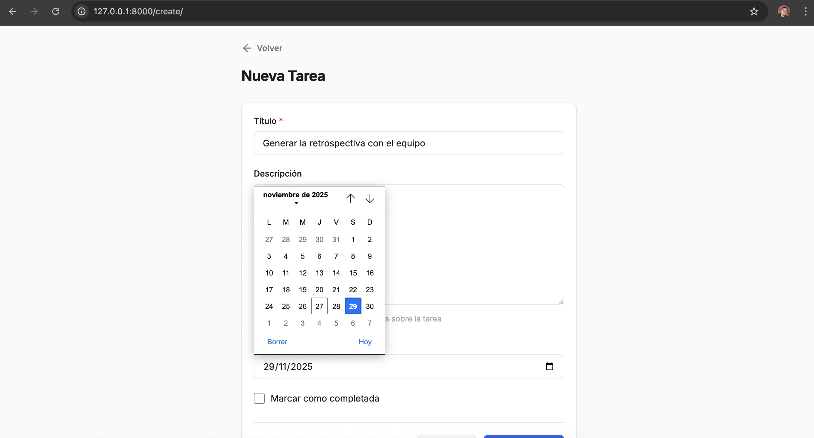
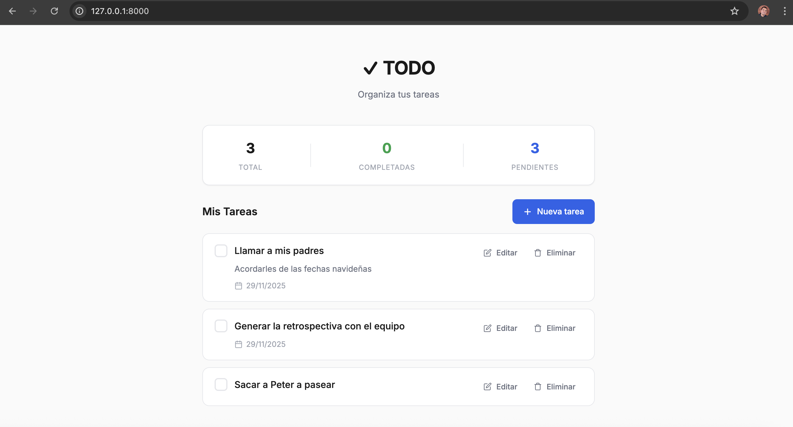
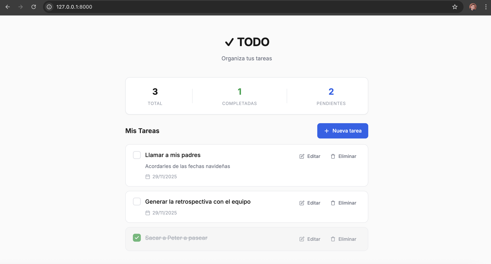

# Simple TODO App

This is a Django application that implements a basic TODO list with due dates and completion status.


## Screenshots

### without_TODOs.png
Initial empty state of the application. When there are no TODOs, the app displays a friendly message with an emoji indicating that no tasks have been created yet. Users can see the "Nueva tarea" button to begin adding their first TODO.



### new_TODOs.png
The form for creating a new TODO. This screenshot shows the input fields for:
- **Título** (Title) — required field
- **Descripción** (Description) — optional field with hint text
- **Fecha límite** (Due date) — optional date picker field
- **Marcar como completada** — optional checkbox to mark as done upon creation



### list_TODOs.png
The main TODO list view showing multiple tasks. This view includes:
- **Stats card** at the top showing: Total TODOs, Completadas (completed), and Pendientes (pending)
- **TODO items** with title, description, due date, and action buttons (Mark done/Unmark, Edit, Delete)
- **"Nueva tarea" button** to create additional tasks



### done_TODO.png
A completed TODO item in the list view. The screenshot shows how a marked-as-done task appears:
- **Strikethrough text** on the title to indicate completion
- **Reduced opacity** for visual distinction from pending tasks
- **"Unmark" button** available to revert completion status
- All other actions (Edit, Delete) remain available



## Notes

- The `due_date` field is a `DateField`. The form uses an HTML5 `date` input for a native calendar picker.
- Model-level validation prevents saving a `due_date` in the past.
- Templates live under `todo/templates/` and are discovered via `APP_DIRS = True`.


## Quick start

Install dependencies and prepare environment as you did before:

```bash
$ curl -LsSf https://astral.sh/uv/install.sh | sh
$ source $HOME/.local/bin/env
$ uv init simple_todo_app
$ cd simple_todo_app/
$ uv add django
```

Run migrations and start the server:

```bash
make makemigrations
make migrate
make runserver
# or
uv run python manage.py runserver
```

Run tests:

```bash
make test
```
